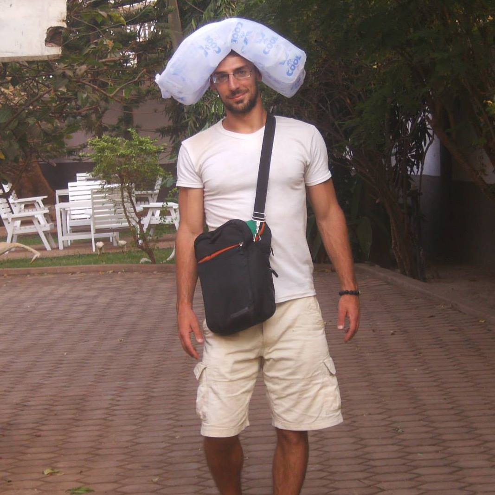
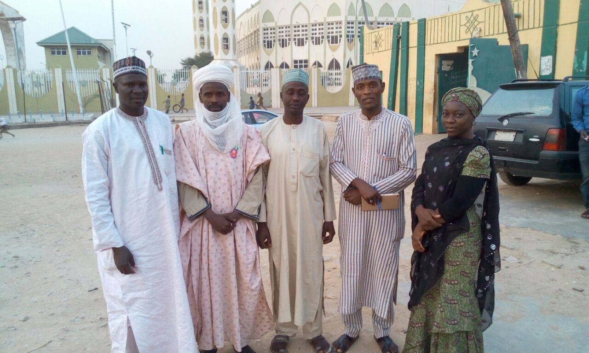
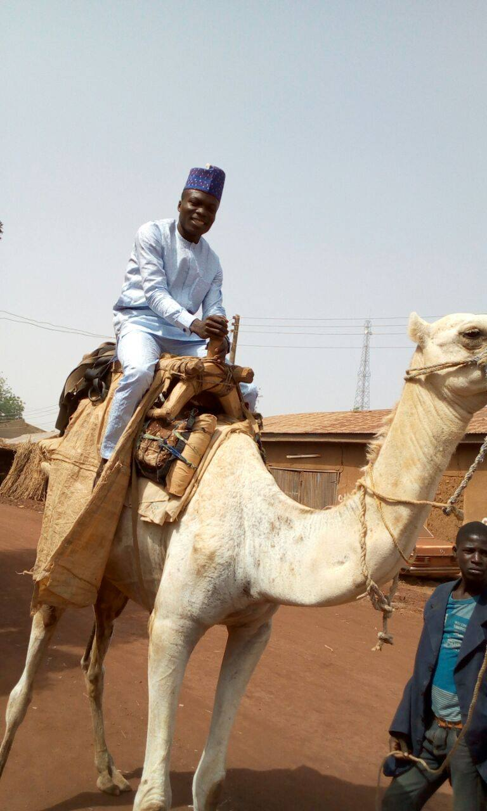
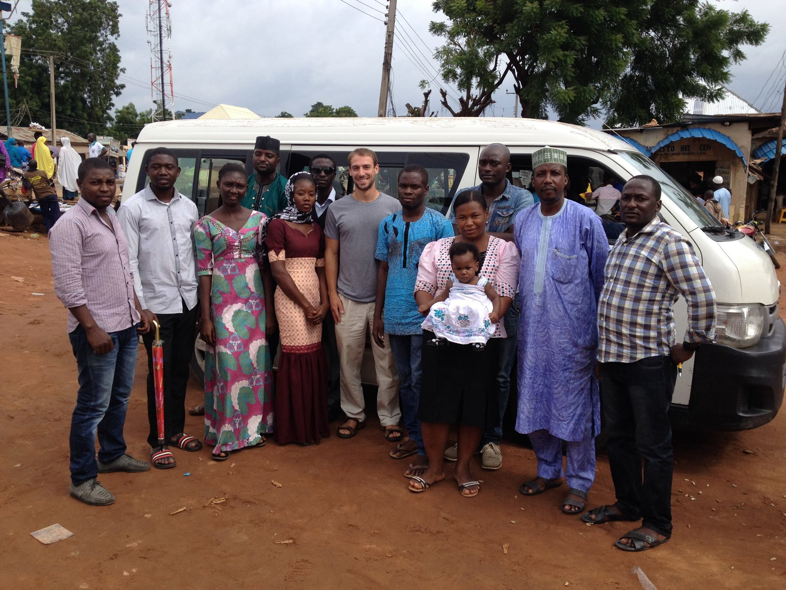

```{r include=FALSE, cache=FALSE, eval=F}
require(knitr)
opts_chunk$set(
  tidy=FALSE,     # display code as typed
  size="tiny",    # slightly smaller font for code
  echo=TRUE,
  results='markup',
  strip.white=TRUE,
  fig.path='figs/fig',
  cache=FALSE,
  highlight=TRUE,
  width.cutoff=132,
  out.width='.9\\textwidth',
  fig.retina=FALSE,
  message=FALSE,
  comment=NA)

#interrupt me at any time, questions or comments.
#Chris Grady, received my PhD from Uni of Illinois around the same time as Alice, we worked together on several projects.  I am now a senior metrics advisor at USAID, in the center for democracy, human rights, and governance.  At USAID, metrics means things like research design, outcome measurement, data collection, data analysis.  So I help design evaluations, read and comment on the methods of evaluations, and create resources to help others at USAID do better evaluations.  Once the pandemic ends, I will do a lot of fieldwork, which I am very much looking forward to and which is what I am here to talk with you all about!

#Before dive into presentation, I will mostly be talking about fieldwork to do field experiments/impact evaluations.  Careful impact evaluation is one way to collaborate with NGOs and governments; it's a common way academics interact with the policy world, and it's the way I have most experience with.  But it's not the only way that academics interact with the policy world and it's not the only way you might interact with NGOs/governments, so keep that in mind.  Still, I think a lot of lessons from doing field experiments carries over to all work with NGOs and governments.
-->
```

# Introduction

<!--
Okay, I'd like to start by talking about some of my fieldwork.  Before the pandemic, I had done about 18 months of fieldwork in Ghana, Nigeria, and Malawi.

Ghana: first project, first real overseas travel.  I was young and I did not know what I was getting into -- I really wish someone had organized this type of discussion to talk about fieldwork!  It was my first time going somewhere where I would not have consistent access to electricity or running water, for example.  In this picture, I am trying to carry bag water on my head -- in Ghana, they sell water in these 500ml plastic bags, and you buy them in packs of 30 for about $1.  Way cheaper than bottles, made drinkable water affordable to millions of people.

I was in Ghana to do the fieldwork needed for a paper with my advisor and other colleagues about voter mobilization and voter fraud committed by Ghanaian political parties. I lived with a Ghanaian family for the first 6 weeks and then spent 6 weeks interviewing about 30 people in 5 Ghanaian provinces.  I recruited my own translator and basically backpacked around the country with him learning how parties mobilized voters and did whatever they could to win the election.

-->



# Introduction

<!--
I next went to Nigeria to work on my first big impact evaluation with an NGO.  This NGO had set up a prosocial television channel and were airing programs that they hoped would increase interethnic and interreligious tolerance, improve attitudes towards women's empowerment and youth empowerment, and generally do other good things.  They asked my advisor and I to assess the channel's imapct.  Around the time Boko Haram was very active, NGO wanted to reduce support for groups like Boko Haram.  My advisor was not about to go to Nigeria, so I went.

I first led a 2000 person baseline survey in six Nigerian states.  This pic is from that -- it is a picture of some of my survey enumrators with representatives of the Emir of Gusau in Nigeria.  Getting support from traditional authorities is a requirement for doing surveys in Nigeria. 

I then setup a couple random or quasi-random evaluations.  In one, we called people and encouraged them to watch the TV channel or an alternative channel as a placebo for 6 months, giving them short weekly surveys through an automated IVR system.  I also set up an inbound IVR system for people who called into the channel -- if they called in about particular shows, they would receive a very short 3-5 question survey.  We used that to see if people who called in just after an episode aired changed attitudes compared to people who called in just before.

Alice and I were working on a project in Niger to make that before/after design a randomized design by calling people just before and just after the episodes aired but the NGO pulled the plug.  That is also something you need to be ready for with fieldwork!  It doesn't always work and you depend a lot on partner organizations.
-->



# Introduction

<!--
I went back to Nigeria for that project a couple times to make sure everything was going smoothly.  One trip we did the endline survey, and one of the villages gave our enumerators camels to get around the village.  The other time I visited I just did a check in to make sure everything was going smoothly -- I was mainly in Nigeria leading a different evaluation. -->



# Introduction

<!--
That evaluation was about farmer-pastoralist conflict; farmers and semi-nomadic pastoralists (animal herders) fight over land a lot.  Every year there are more people and less land, so these groups come into conflict a lot in the Sahel and especially in Nigeria.  I led the randomized evaluation of a big NGO peacebuilding program to reduce conflict.

One of the villages lent me a little horse to get around.
-->


# Introduction

<!--
And This is me with one of the enumeration teams. They do the hard work, so always spoil your enumeration teams.  I led baseline and endline surveys + behavioral observations in between, and I was lucky enough to have great teams for all of it.
-->



# Introduction

<!--
Most recently, I was part of a big project in Malawi.  Part of a metaketa, which is a group of randomized interventions all doing similar things and looking at the same outcomes.  On a team with other awesome colleagues from Uni of Illinois.

For us in Malawi, we helped the city get a garbage truck and evaluated the effect on citizens' attitudes and tax payment.  This was the first project where I got to design the intervention, not just the evaluation.

Here's the truck.
-->


# Introduction

<!--Here's the survey team -->


# Introduction

<!--And here is one of our community dissemination events, where we returned to the communities and told them what the study found.  This picture is from March 2020, a few days before I had to return to the US due to covid. 

Okay, so that's my experience.  Moving up from interviews in Ghana in support of a paper, to being the guy "in the field" on a big evaluation in Nigeria, to being totally in charge of an NGO evaluation in Nigeria, to being in charge of the evaluation and intervention in Malawi.

-->


# Roadmap

<!-- 
Now that I've quickly summarized my fieldwork experiences, I'll tell you some of what I learned doing it.
-->

- Implementation Partners
- Being in the Field
- Intervention and Evaluation
- Running the Show

# Questions

Ask now!

# Implementation Partners

How to get involved with implementers

  - Professor throws you a project
  - Meet at a conference
  - Pro bono "cold call" from you
  - University collaborations
  - Sites that connect researchers and implementers: research4impact, egap, others

- Implementers want prior RCT experience, experience in-country
- Bigger NGOs will want established professors

# Implementation Partners

How to work with non-academics

  - Theoretical vs. practical divide <!--Works on paper, not in real life.  Figure out what really matters about the theory and how to put the theory into practice -->
  - Compromise away from perfection
  - Avoid jargon
  - Explain how long data work can take <!--They will have no idea -->
  - Expect Googledocs
    
# Implementation partners

Priorities and incentives

  - Implementing organizations will want you to do a lot of work that is irrelevant for you
  - Look our for your own interests
  - Implementers _need_ to make themselves look good to maintain grant funding

# Being in the Field

- You need to go <!--or you need to pay a really good partner and communicate daily-->
- You want to go <!--You will get to go to wondrous places few people ever see -->
- Establish personal relationships or you will be in the dark and nothing will get done
- Bring gifts that are identifiably _American_

\smallskip

- Implementer priority: show their project is successful, not to evaluate if the project was successful.

\note{

You need to be involved with the intervention, not lead it from afar.

Otherwise you'll find out 6 months later that they did not like the randomization and so didn't use it.  Or that they started the intervention before the baseline survey because they didn't want to wait.  Or that a control site and treatment site are less than 1 mile apart.  Or that they changed the intervention and it's totally different now (NGOs are _always_ adapting).

}

# Being in the Field

<!--These things apply to almost all international travel, so forgive me if these are already extremely obvious to all of you. -->
- Learn the language actively <!--With a little effort, can say every simple thing in local language within 1 month. -->
- Learn and follow cultural etiquette <!--Normally very easy, about being respectful.  But don't compromise yourself; stop if you feel uncomfortable.-->
- Calm yourself when you want to start an argument <!--Story about going to Mustafa's and his wife not eating with us, I thought it was disrespectful towards women but she would have been very uncomfortable eating with us.  Isaac and non-alcoholic wine. -->

# Being in the Field

- Don't bring anything you are afraid to lose
- If not staying in a fancy hotel, be ready for lack of water/electricity

\medskip

- Start slow and increase intake of local food each day
- Learn what you can and cannot get in-country <!--Contact solution, good coffee are rare. -->
- Get a local phone and simcard
- Get personal wifi connection


# Being in the Field

- Learn to get around without help
- Find amenities and activities -- gyms, basketball/soccer club, local bars
- Travel when possible -- do **not** watch TV in a hotel room
- Hang out with locals
- Bring books to read

\medskip

- Enjoy it!  Make friends!

# Interventions and Evaluations

# What is a field experiment?

- An experiment done outside of a lab, with real people who don't know they are part of an experiment
  - Lab: show people video, survey those people
  - Field: Show a video in a local theatre; survey people who attended
- Researchers assign and administer experimental intervention

\smallskip

- Different than natural/quasi-experiment where intervention is incidentally random or as-if random <!--You don't administer anything or make sure randomization is being done correctly in one of these. -->

# Interventions and Evaluations

- Don't let the tail wag the dog -- don't change the intervention so that it can be evaluated more easily
- Make implementers part of design discussions so it is a _team_ design, not _your_ design
- Be flexible where things are not imperative
- Be firm where things are necessary <!--"Chris isn't being unreasonable.  I talked to some people and they said it isn't an experiment if you don't have randomization and a control group." -->


# Interventions and Evaluations

- Field experiments are a mess -- multiple things will go wrong
- Randomization at multiple levels
- Simple designs are more likely to be implemented faithfully; complex designs are beautiful and fragile
- Feasibility extends to survey questions and implementation, observational monitoring procedures, everything
  - Survey experiments are hard on enumerators because the question wording changes every interview

\smallskip

- To NGOs, two-arm RCTs are already complicated.  
- Difficult to pitch more complicated things, like multi-arm designs, saturation designs, etc...

# Interventions and Evaluations

- Everything is clustered
- Everything spills over

\bigskip

- Get the Gerber and Green book.


# Data Collection Methods

- Surveys <!--Lots of tablet survey applications, should learn to code yourself -->
    - In person
    - Mobile phone "IVR" surveys
- Observational measures
- Naturalistic behavioral games
- Focus groups and "Key Informant" interviews
- Others?

\note{
- Questions in one context make no sense in another context
- Yes/No + how strongly do you feel > likert scales.
- Huge agreement bias.


Would you be comfortable with someone from the same religion but a different denomination marrying into your family?
Would you be comfortable with someone from a different religion marrying into your family?

Would you accept someone from a different religion seeking your hand in marriage without converting? - 85% no
Would you accept someone from a different religion seeking marriage with one of your family members without converting? - 85% no

Would you marry someone you loved, even if they practiced a different religion? - 50% yes, 50% no.


There is more than one valid interpretation of religious teachings.

An Arabic word Bid'ah means innovation, connotation heretical teachings.  Innovations -- unorthodox interpretations of Koranic teachings -- are often blamed for violence in NE Nigeria.  So lots of tolerant people said no.

A woman should have a say in how her household spends money.  

}


# Running the Show

- You are in charge and there is no reset button or second chance
- Putting your money into it -- sometimes necessary (get per diem)
- Staying up until 3am every night for two weeks
- Hard deadlines

# Running the Show

- Lead by example: get sweaty, get cold, get uncomfortable
- Don't ask others to do what you will not do
- Be SUPER ORGANIZED


# Conclusion

- Fieldwork and field experiments are great opportunities for researchers
- Working with implementation partners can be difficult but rewarding
- Enjoy experiencing another country
- Keep your designs simple
- Use multiple methods of data collection
- Lead by example

# Conclusion

- Do you really want to do a field experiment/RCT?

\medskip

- Take a lot of time
- Require a lot of non-academic work
- High fail rate


